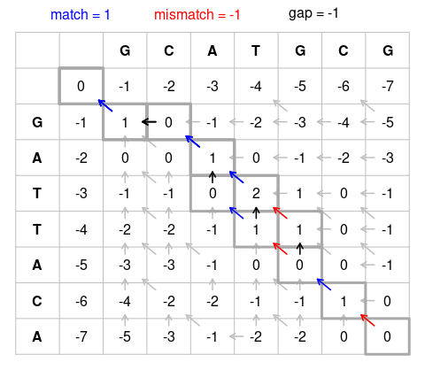

# The Principles of DNA Sequence Compression

Jupyter notebook to demonstrate the principles of DNA sequence compression.

If you are on a Linux system ([WSL](https://docs.microsoft.com/en-us/windows/wsl/) also counts), the most straightforward way is to do everything in a tidy and isolated virtual environment.

Create a virtual environment, activate it, install required packages, and fire up jupyterlab:

```bash
python3 -m venv .venv
source .venv/bin/activate
python3 -m pip install -r requirements.txt
jupyter-lab
```

This should open the jupyterlab interface in your default browser. From here you can view, edit, and execute the notebook.

In the case that you want or need to use an already existing jupyterlab installation, download the repository as a zip file, unpack it, and open the notebook using the interface from your existing jupyterlab installation.

## Quantification of Information

Information theory is based on the observation that knowing that a likely event has occurred is less informative than knowing that an unlikely event has occurred.

A quantification of information should have the following properties:

- Likely events should have a low information content, and events that are certain to occur should have no information content at all. Less likely events should have a higher information content.
- Independent events should have additive information content.

The self-information of an event $x$ is hence defined as

$$I(x)=-\log{}P(x).$$

By using the base-2 logarithm, the unit of self-information is bit. Hence, one bit is the amount of information gained by observing an event of probability $\frac{1}{2}$.

Self-information deals only with a single event $x$. By computing the expectation of the self-information with respect to the entire probability distribution $P(\text{x})$ we obtain the entropy

$$
H(x)=-\sum_{x}P(x)\log_2 P(x).
$$

The entropy gives the average information that is expected in an event $x$ drawn from probability distribution $P(\text{x})$.

## Na&iuml;ve Compression of DNA Sequence Reads

The FASTQ format is the de-facto standard for the storage of reads, i.e., nucleotide sequences, including corresponding quality scores.

Each read is represented by a single FASTQ record, which consists of four lines:
- The first line contains the read identifier. It starts with `@`. Typically, sequencing machine vendors generate read identifiers in a proprietary systematic way.
- The second line contains the nucleotide sequence, where each nucleotide is represented with a single ASCII character.
- The third line starts with `+` and contains an optional description. Usually this line is left empty; it then only contains `+` as separator between the nucleotide sequence and the quality scores.
- The fourth line contains the quality scores. A quality score is a value indicating the confidence in a base call.

## Using Alignment to Improve Compression of DNA Sequence Reads

The Needleman-Wunsch algorithm finds the optimal *global* alignment (end-to-end) between two sequences. It consists of the following steps:

- Construct the grid
- Choose a scoring system (here we use the original scoring system assigning a score of 1 to a match and a score of -1 to a mismatch or indel/gap)
- Fill in the scoring matrix (and construct the pointer matrix on the way)
- Use the pointer matrix to perform a traceback to recover the optimal warping path

The scores are computed using the already existing scores in the left, top-left, and top cells:

$$
F(i,j)=\max\{\begin{cases}{ll}
F(i-1,j-1)+s(x_i,y_i),\\
F(i-1,j)-d,\\
F(i,j-1)-d
\end{cases}.
$$

The following image illustrates the scoring and pointer matrices.



The Smith-Waterman algorithm finds the optimal *local* alignment between two sequences. It is a variation of the Needleman-Wunsch algorithm. The three main differences are:

|                | Smith-Waterman algorithm                                | Needleman-Wunsch algorithm                                                 |
|----------------|---------------------------------------------------------|----------------------------------------------------------------------------|
| Initialization | First row/column = 0                                    | First row/column subject to gap penalty                                    |
| Scoring        | Negative scores are set to 0                            | Scores can be negative                                                     |
| Traceback      | Begin with the highest score, end when 0 is encountered | Begin with the cell at the lower right of the matrix, end at top left cell |
